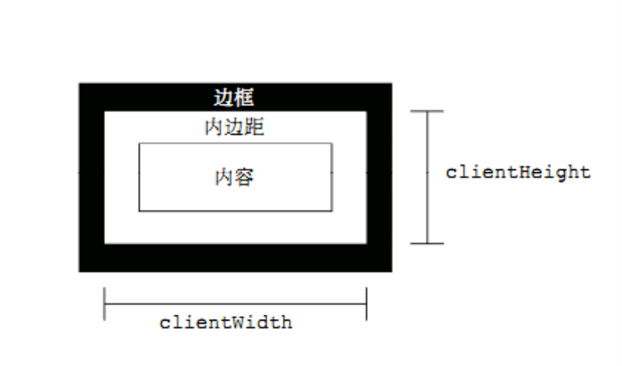

# webAPI

## 学习目标

[TOC]


### 理解

* 能说出API 是什么
* 能说出webAPI 是什么
* 能够说出webAPI 由哪两个部分组成
* 什么是节点
* 什么是DOM树
* 什么是事件委托
* 什么是BOM
* 什么是url

### 重点

- 掌握DOM中常用的表单元素的属性
- 掌握DOM中操作元素样式的两种方式
- 掌握DOM中操作标签的自定义属性方法
- 掌握创建元素的三种方式
- 掌握节点的常用属性和方法
- 掌握注册事件的其他方式
- 掌握移除事件的方法
- 掌握事件对象的常用的属性和方法
- 知道事件的三个阶段
- 掌握页面加载事件
- 掌握一个完整url的组成部分
- 掌握location对象常用的方法和属性
- 掌握history对象常用的方法
- 掌握navigator对象的userAgent属性的作用
- 掌握设置定时器的两种方法
- 掌握移除定时器的方法
- 掌握offset系列属性
- 掌握clientWidth和clientHeight
- 掌握scroll系列的属性
- 掌握如何获取浏览器可视区的大小
- 掌握如何获取整个页面滚动出去的距离

## 概念

### 1. API 是什么

**概念:** API（Application Programming Interface,应用程序编程接口）`是一些预先定义的函数`，目的是提供应用程序与开发人员基于某软件或硬件得以访问一组例程的能力，而又无需访问源码，或理解内部工作机制的细节。

- 任何开发语言都有自己的API
- API的特征输入和输出(I/O)
  - var max =  Math.max(1, 2, 3);
- 如何学习API: 
  - 掌握这个API的功能(作用)
  - 掌握这个API要传递的参数
  - 掌握这个API执行完毕之后返回值是什么

### 2.webAPI 是什么

**概念:**  浏览器提供的一套操作浏览器功能(BOM)和页面元素的API(DOM)

我们学习webAPI主要学习两大部分

- DOM 
- BOM 


## DOM

## 常用的表单元素的属性

- value 用于大部分表单元素的内容获取(option除外)
- type 可以获取input标签的类型(输入框或复选框等)
- disabled 禁用属性
- checked 复选框选中属性
- selected 下拉菜单选中属性

**案例 :** 

- 点击按钮禁用文本框
- 设置下拉框中的选中项
- 搜索文本框
- 全选反选

### 小结:

disabled, checked, selected 这些布尔值属性,在DOM中通过true/false修改状态

true 是让属性的作用生效,false 为不生效

## 操作样式的两种方式

- 通过元素的style属性
- 通过元素的className属性

###  通过style属性操作样式

**注意:** 通过style属性设置样式时,css中要写单位的属性,在js代码中也要加单位

**示例代码 : **

```javascript
//html
<div id="box"></div>

//js
var box = document.getElementById('box');
box.style.width = '100px';
box.style.height = '100px';
box.style.backgroundColor = 'red';

//通过style属性设置样式执行完毕之后的html标签的变化
//相当于给标签添加了行内样式

<div id="box" style="width:100px; height:100px; background-color:red">
```


### 通过className操作样式

**示例代码 : **

```javascript
//html
<div id="box"></div>

//css
.show{
     width:100px;
     height:100px:
     background-color:red;
}

//js
var box = document.getElementById('box');
box.className = 'show'

//通过className属性设置样式执行完毕之后的html标签的变化
//相当于给标签添加了类名
<div id="box" class="show">
```

**案例 :** 

- 点击按钮改变div的位置和背景颜色

- 图片切换二维码案例

- 当前输入的文本框高亮显示

  ​

### 小结:

- 通过style属性操作样式,相当于给标签添加了行内样式
- 通过className属性操作样式,相当于给标签添加了类名

## 标签上自定义属性的操作

> 为什么要学习操作标签的自定义属性 ?
>
> 因为在开发中,有时候会需要给标签上添加一些自定义属性用来存储数据或状态
> 但是DOM对象并不能直接使用点语法获取到这些自定义属性的值

### 3.1 获取自定义属性的值

**语法:**  element.getAttribute('属性名')  返回对应属性的值 ,如果没有返回null

```javascript
//html
<div id="box" index="0"></div>

//js
var box = document.getElementById('box');
var value = box.getAttribute('index');
console.log(value) // 0
```


### 3.2设置自定义属性的值

**语法:**  element.setAttribute('属性名', '属性的值')  返回undefined

```javascript
//html
<div id="box" ></div>

//js
var box = document.getElementById('box');
box.setAttribute('index', 0); 

//js代码执行完毕之后.html的标签的变化
<div id="box" index="0"></div>

```


### 3.3 移除自定义属性的值

**语法:**  element.removeAttribute('属性名')  返回undefined

```javascript
//html
<div id="box" index="0"></div>

//js
var box = document.getElementById('box');
box.removeAttribute('index'); 

//js代码执行完毕之后 html的标签的变化
<div id="box" ></div>
```


**案例 :** 

- 列表隔行变色、高亮显示

### 小结:

- 操作自定义属性的这三个方法,不仅可以操作自定义属性,同时也可以操作html规范中的属性
- 设置的属性的值,最终都转换成了字符串的形式


##  节点

根据 W3C 的 HTML DOM 标准，HTML 文档中的所有内容都是节点(文档,标签,文本,属性,注释)

- 整个文档是一个文档节点
- 每个HTML标签是一个标签节点/元素节点
- HTML 标签内的文本是文本节点
- 每个HTML标签的属性是属性节点
- 注释是注释节点

### DOM树

当浏览器加载文档的时候,会将文档中每一个节点,以树状的结构组织起来,我们将这种结构称为之节点树或DOM树


### 节点中常用的属性和方法

#### 1. 节点类型的属性

- nodeType  节点的类型
  - 1 元素节点
- nodeName  节点的名称
- nodeValue  节点值
  - 元素节点的nodeValue始终是null

#### 2.节点层级的属性


- 找儿子的属性:

  - children  返回包含所有子元素的伪数组
  - childNodes 返回包含所有的子节点的伪数组

- 找父亲的属性:

  - parentNode 返回父节点

- 找兄弟

  - nextElementSibling 返回下一个兄弟元素

  - previousElementSibling 返回上一个兄弟元素

    ​

#### 3. 操作节点的方法

- appendChild() 往节点的内容后面添加一个子节点

  **语法:**  父节点.appendChild(子节点)

  ```javascript
  //html
  <div id="far">
      <div id="one"></div>
  </div>
  <div id="two"></div>

  //js
  var far = document.getElementById('far');
  var two = document.getElementById('two');
  far.appendChild(two);

  //js执行之后的效果
  <div id="far">
      <div id="one"></div>
  	<div id="two"></div>
  </div>
  //appendChild方法会将一个节点添加到另一个节点内容的尾部,如果这个被添加的节点是本身在页面上存在的,则会有剪切的效果
  ```


- insertBefore() 往节点里面添加一个子节点,这个子节点的位置在参考子节点之前

  **语法: **node.insertBefore(要插入的节点, 参考子节点)

  ```javascript
   //html
    <div id="far">
        <div id="one"></div>
    </div>
    <div id="two"></div>

    //js
    var far = document.getElementById('far');
    var one = document.getElementById('one');
    var two = document.getElementById('two');
    far.insertBefore(two,one)

    //js执行之后的效果
    <div id="far">
        <div id="two"></div>
        <div id="one"></div>
    </div>
    //insertBefore是插入到参考节点之前,也有剪切的效果
  ```

  ​


- removeChild() 移除某个子节点

  **语法: **node.removeChild(要被删除的节点); 返回被移除的节点

  ```javascript
  //html
  <div id="far">
      <div id="son"></div>
  </div>

  //js
  var far = document.getElementById('far');
  var son = document.getElementById('son');
  var result = far.removeChild(son);
  console.log(result);  //<div id="son"></div>

  //js执行之后的效果
  <div id="far">
  </div>
  ```

  ​

- replaceChild() 替换节点使用其他节点替换掉自己的某个子节点

  **语法: **element.replaceChild(替换的节点, 被替换的子节点);

  ```javascript
  //html
  <div id="far">
      <div id="one"></div>
  </div>
  <div id="two"></div>

  //js
  var far = document.getElementById('far');
  var one = document.getElementById('one');
  var two = document.getElementById('two');
  far.replaceChild(two,one);

  //js执行之后的效果
  <div id="far">
      <div id="two"></div>
  </div>
  //也有剪切的效果
  ```

  ​

- cloneNode() 克隆节点

  **语法: **element.cloneNode([true]) ;  

  参数是boolean值,不传参数默认是false,为浅拷贝.传true,则是深拷贝

  ​

  ```javascript
  //html
  <div id="box">
      div里面的内容
  	<p>p元素</p>
  </div>

  //js
  var box = document.getElementById('box');
  console.log(box.cloneNode()); //<div id="box"></div>

  console.log(box.cloneNode(true)) //<div id="box">  div里面的内容 <p>p元素</p> </div>
  ```

  ​

### 小结:

- 有剪切效果的方法:
  - appendChild()
  - insertBefore()
  - replaceChild()
- 移除的方法
  - removeChild()
- 需要传递两个参数的方法:
  - insertBefore(要插入的节点, 参考节点) 
  - replaceChild(替换的节点, 被替换的节点)


**案例:**

选水果

##  创建元素的三种方式

### 2.1 innerHTML

**语法:**  element.innerHTML = '标签字符串'

```javascript
//html
<div id="box">
    这是div中的内容
</div>

//js
var box = document.getElementById('box');
box.innerHTML = '<p>这是动态增加的p标签</p>'

//js代码执行完毕之后的结果
<div id="box">
    <p>这是动态增加的p标签</p>
</div>

```


### 2.2 docuement.write()

**语法:**  document.write('标签字符串')

```javascript
//html
<body>
</body>

//js
document.write('<div>这是动态增加的p标签</div>')

//js代码执行完毕之后的结果
<body>
    <div>
    	这是动态增加的p标签
	 </div>
</body>

```


### 2.3 document.createElement()

**语法:**  document.createElement('标签名')

```javascript
///html
<div id="box">
</div>

//js
var newElement = document.createElement('p'); //此时新创建出来的newElement并没有加入到DOM树中
var box = document.getElementById('box');
box.appendChild(newElement);// 通过appendChild这个方法,将新元素添加到已经在DOM树中的元素中,这样新
//创建出来的元素才会添加到DOM树中,然后渲染到页面上展示出来


//js代码执行完毕之后的结果
<div id="box">
    <p></p>
</div>
```


### 小结:

innerHTML 会覆盖原来元素里面的内容,并且会将新的元素直接渲染到页面上,但是不推荐用来创建表格(常用)

document.write() 也会直接渲染到页面上,并且在事件中执行的话,会覆盖原来页面的内容(慎用)

docuement.createElement() 只是在内存中创建出来一个元素,但是并没有添加到DOM树中(常用)


## 注册事件的其他方式

### 回顾:

刚开始我们给元素注册事件的方式,是通过on+事件名的方式,如下面的示例代码

```javascript
//html
<div id="box"></div>

//js
var box = document.getElementById('box');
box.onclick = function(){
    //code...
}
```

后来,W3C DOM 规范中提供了注册事件监听的另外一种方式  : addEventListener

**那么为什么要使用addEventListener呢?**

**优点: **

- 它允许给一个事件注册多个 `listener`。 
- 它提供了一种更精细的手段控制 `listener` 的触发阶段。（即可以选择捕获或者冒泡）。
- 它对任何 DOM 元素都是有效的，而不仅仅只对 HTML 元素有效。

**语法: **

element.addEventListener('事件名', 事件处理函数, useCapture);

- 事件名不需要写on
- useCapture 是一个boolean值,用于控制事件触发的阶段,不写默认是false
  - false 是在冒泡阶段执行
  - true 是在捕获阶段执行

```javascript
//html
<div id="box"></div>

//js
var box = document.getElementById('box');
box.addEventListener('click', function(){
    //code...
}, false);
```


##  移除事件的方式

### 1 on+事件名 的移除方式

on + 事件名 = null;

```javascript
//html
<div id="box"></div>

//js
var box = document.getElementById('box');
box.onclick = function(){}  //注册点击事件
box.onclick = null; //移除点击事件
```


### 2 addEventListener的移除方式

removeEventListener()

**注意: **

如果在代码中使用addEventListener注册的事件,后面的逻辑中要移除对应的事件,那么在注册时,事件处理函数就不能使用匿名函数的方式

```javascript
//html
<div id="box"></div>

//js
var box = document.getElementById('box');
box.addEventListener('click', boxClick, false); //注册的代码,注册时不能使用匿名函数
box.removeEventListener('click', boxClick, false); //移除的代码
function boxClick (){
    //code...
}
```


### 小结:

- 注册事件的两种方式
  - on + 事件名 = function(){}
  - addEventListener('事件名', 事件处理函数, useCapture ) 
- 移除事件对应的两种方式
  - on + 事件名 = null;
  - removeEventListener('事件名', 事件处理函数, useCapture )
    - 注意 : 注册时,事件处理函数不能使用匿名函数的形式

## 事件对象

> 当用户触发了我们注册的事件之后,我们在开发中需要获取用户触发事件的一些信息,比如鼠标的坐标,键盘的按键等...

**那么我们在代码中如何获取这些信息呢?**

当用户触发我们注册的事件之后,浏览器会创建一个事件对象,这个事件对象就包含了触发事件时的一些信息,比如时间戳,鼠标坐标,事件目标等等.然后浏览器会将这个事件对象,传递给事件处理函数,那么我们只需要在事件处理函数中申明一个形参,接收一下即可.如下面的示例代码所示:


```javascript
//html
<div id="box"></div>

//js
var box = document.getElementById('box');
box.onclick = function(event){
    console.log(event) // 事件对象
}
```


### 1 事件对象的常用属性

- event.type  返回事件类型(也就是事件名);
- event.target    返回事件目标
- clientX/clientY     返回鼠标在可视窗口的坐标
- pageX/pageY       返回鼠标在当前页面的坐标
- keyCode   返回键盘按键对应的数字

### 2 事件对象的常用方法

- event.preventDefault() 取消默认行为

  > 我们第一天学习给a标签注册点击事件的时候,要在事件处理函数的最后一行写return false ,来阻止a标签的默认行为.
  >
  > 但是如果使用addEventListener注册事件的话,return false 是无效的.
  >
  > 所以我们需要使用 event.preventDefault()来阻止a标签的默认行为 ,如下面的代码

  ```javascript
  //html
  <a id="link" href="">点击在控制台打印1</a>

  //js
  var link = document.getElementById('link');
  link.addEventListener('click', function(){
      console.log(1);
      // return false;    //无效
      e.preventDefault(); //有效
  },false)
  ```

  ​

- event.stopPropagation() 阻止事件传递

**案例: **

- 小天使跟着鼠标飞
- 按下按键,显示对应的键盘数字


##  事件流

事件对象需要被分派到事件目标。但是在分派开始之前，必须首先确定事件对象的传播路径,传播路径是事件通过的当前事件目标的有序列表,该传播路径反映文档的分层树结构.

列表中的最后一项是事件目标，并且列表中的前面的项目被称为目标的祖先，其中前面的项目作为目标的父项目.一旦确定了传播路径，事件对象就会经过一个或多个事件阶段。


共有三个事件阶段：捕获阶段，目标阶段和冒泡阶段。

### 捕获阶段：

事件对象通过目标的祖先从窗口传播到目标的父项。这个阶段也被称为捕获阶段

### 目标阶段：

事件对象到达事件目标。这个阶段也被称为目标阶段。

### 冒泡阶段：

事件对象以相反的顺序通过目标的祖先传播，从目标的父项开始，以窗口结束。这个阶段也被称为冒泡阶段


## 事件委托

### 1 什么是事件委托 :

本来是要注册给自己的事件,注册给了父元素.事件触发后的事情,委托给父元素执行


### 2 事件委托的好处 :

- 代码简洁

- 节省内存

  ​

### 3 事件委托的原理 :

事件冒泡


## BOM

**概念: **BOM(Browser Object Model) 是指浏览器对象模型,浏览器对象模型提供了独立于内容的、可以与浏览器窗口进行互动的对象结构。BOM由多个对象组成，其中代表浏览器窗口的Window对象是BOM的顶层对象，其他对象都是该对象的子对象。

**通俗理解: ** 把浏览器当做对象,通过访问对象的属性,实现操作浏览器的一组方法


### 页面加载事件

#### 1 load事件

```javascript
window.onload = function () {
  
  // 当页面加载完所有内容（包括图像、脚本文件、CSS 文件等）执行
}
```

#### 2 unload事件

```javascript
window.onunload = function () {
  // 当用户退出页面时执行(关闭页面)
}
```


#### 小结:

window.onload事件 是页面所有资源加载完成时触发

window.onunload事件 是用户退出页面时触发

### location对象

> location 相当于浏览器地址栏的抽象, 通过window.location可以访问到,window可以忽略不写
>
> 我们学习location对象,目的是为了操作地址栏里面的url地址


####  URL

**概念:**统一资源定位符 (Uniform Resource Locator, URL)

**通俗理解:** 互联网中的地址

**URL的组成**


- scheme:通信协议

  常用的http,ftp,maito等

- host:主机 (找计算机)

  服务器(计算机)域名系统 (DNS) 主机名或 IP 地址。

- port:端口号 (找软件)

  整数，可选，省略时使用方案的默认端口，如http的默认端口为80。

- path:路径

  由零或多个'/'符号隔开的字符串，一般用来表示主机上的一个目录或文件地址。

- **query:查询**

  可选，用于给动态网页传递参数，可有多个参数，用'&'符号隔开，每个参数的名和值用'='符号隔开。

  ```
  例如：name=zs
  ```

- fragment: 信息片断

  字符串，锚点.

####  location属性和方法

- **href     返回地址栏的整个url,设置值的时候,也可以起到跳转页面的作用**

- **hash    返回地址栏url的fragment**

- host     返回地址栏url的主机名

- **search   返回地址栏url的键值对参数(query)**

- reload()  设置页面刷新

  **语法:** location.reload([boolean]) 

  > 参数是一个布尔值,不传参数则默认是false. 普通刷新,可能会从缓存拿数据
  >
  > 传true的话,是强制刷新.强制浏览器去服务器获取数据

- assign()   设置页面跳转,记录历史

  **语法:** location.assign('url地址')

- replace() 设置页面跳转,不记录历史

  **语法:**location.replace('url地址')

#### 小结:

- location对象代表浏览器的地址栏.
- 学习location的目标主要是为了操作地址栏的url地址
- 网络中的地址我们称为url

### history对象

- back() 返回上一个页面

  **语法:** history.back();

- forward() 前进到下一个页面

  **语法: **history.forward();

- go(1/-1)  前进/ 返回

  **语法:** history.go(number);

  > 正数是前进,负数是后退.

  ```javascript
  history.go(1); //前进一步
  history.go(2); //前进两步
  history.go(-3); //后退三步
  ```

### navigator对象

- userAgent  返回识别客户端浏览器的字符串

  **语法:** navigator.userAgent

### 定时器

#### 设置定时器

##### setTimeout()

**作用:** 到达间隔时间之后,只调用一次回调函数

**语法: ** window.setTimeout(回调函数, 间隔时间) 

> - window可以省略
> - 间隔时间以毫秒为单位
> - 返回这个定时器的标识符,是数字类型

```javascript
// 创建一个定时器，1秒后执行
// timerId指向这个定时器的标识符
var timerId = setTimeout(function () {
  console.log('Hello World');
}, 1000);
```


#####  setInterval()

**作用:** 每隔一个间隔时间,就调用一次回调函数

**语法: ** window.setInterval(回调函数, 间隔时间) 

> - window可以省略
> - 间隔时间以毫秒为单位
> - 返回这个定时器的唯一标示符,是数字类型

```javascript
// 创建一个定时器，每隔1秒调用一次
//timerId 指向这个定时器的标识符
var timerId = setInterval(function () {
  var date = new Date();
  console.log(date.toLocaleTimeString());
}, 1000);
```


#### 清除定时器

#####  clearTimeout()

**作用: **清除以setTimeout方法设置的定时器

**语法:** widnow.clearTimeout(定时器的标识符)   window可以忽略

#####  clearInterval()

**作用: **清除以setInterval方法设置的定时器

**语法:** widnow.clearInterval(定时器的标识符)   window可以忽略


### 小结:

- 设置定时器  setTimeout 和 setInterval
- 清除定时器 clearTimeout 和 clearInterval

**案例：**

倒计时
简单动画


## 特效

### 1.1 offset系列

- offsetParent  用于获取定位的父级元素
- offsetLeft 距离定位父元素的左偏移量
- offsetTop 距离定位父元素的上偏移量
- offsetWidth 当前元素的宽度
- offsetHeight 当前元素的高度


**小问题**:

offsetParent和parentNode的区别?

- offsetParent 返回的是离自己最近的定位父元素
- parentNode 返回的是直接父元素

### 1.2.client系列

- clientWidth 元素可视区的宽度  
- clientHeight 元素可视区的高度



### 1.3.scroll系列

- scrollLeft 元素中内容左侧滚动出去的距离
- scrollTop  元素中内容顶部滚动出去的距离
- scrollWidth   元素中内容的宽度
- scrollHeight   元素中内容的高度


### 小结:

- offset, client, scroll系列返回的都是数字类型(Number)
- 返回的值是所有样式渲染到页面上的最终结果

### 1.4. 获取浏览器可视区的大小

- window.innerWidth  浏览器可视区的宽度
- window.innerHeight  浏览器可视区的高度

### 1.5.获取页面滚动出去的距离

- window.pageYOffset  顶部滚动出去的距离
- window.pageXOffset  左侧滚动出去的距离​


## 扩展内容

### DOM对象的dataset属性方式获取data-xxx方式定义的属性

> 由于我们经常需要在标签上自定义属性来存储数据或状态,但是如果用传统的方式操作起来比较繁琐,而且不熟悉html规范的人,很容易把自定义的属性和html规范的属性混淆.为了更加方便,高效的实现这个需求,我们可以使用dataset属性

使用DOM对象的dataset属性,操作自定义属性时要注意的三点问题:

1. 在标签上定义属性时,要以data-为前缀

2. 在js中获取/设置通过data-定义的属性的值时,要通过dataset来获取/设置

   ​

```javascript
//html
<div id="box" data-index="0" i="0"></div>

//js
var box = document.getElementById('box');
console.log(box.dataset) //返回一个对象,里面包含了所有当前标签上用data-定义的属性
console.log(box.dataset.index) //返回data-index 的值

```


### 节点层级的其他属性

- firstChild  返回第一个子节点
- lastChild   返回最后一个子节点
- firstElementChild 返回第一个子元素
- lastElementChild  返回最后一个子元素
- nextSibling 返回下一个兄弟节点
- previousSibling 返回上一个兄弟节点

### 节点属性的兼容性问题:

- children 在ie6-8浏览器中返回的内容会包含注释节点
- firstElementChild  ie9+才支持
- lastElementChild   ie9+ 才支持
- nextElementSibling  ie9+才支持
- previousElementSibling ie9+才支持

### 创建元素的三种方式的效率问题

- document.write() 和 innerHTML都是解析字符串执行效率相同
- document.createElement 直接创建元素,执行效率比前两者高很多
- document.write() 和 innerHTML优化后的代码效率跟document.createElement类似


### addEventListener 在早期的ie8浏览器中不支持

  如果要在ie8中注册多个相同的事件,使用attachEvent这个方法

  **语法: **element.attachEvent('on + 事件名', 事件处理函数);

  ​

```javascript
  //html
   <a id="link" href="">点击在控制台打印1</a>

  //js
  var link = document.getElementById('link');
  link.attachEvent('onclick',function(){
          console.log(1);
          return false; //阻止a标签的默认行为
   });

```

  **注意:**

1. 在attachEvent中的第一个参数要加on

2. 在attachEvent中阻止a标签的默认行为用return false

3. attachEvent 对应移除事件的方法是detachEvent

4. 同样,如果要移除事件,在注册事件时,事件处理函数也不要写成匿名函数

   ​

###  事件对象的兼容性问题

如果在ie8中使用onclick注册事件,那么浏览器不会把事件对象,传递到事件处理函数中,

而是把事件对象绑定到了window的event属性上面.

**兼容性的写法: **

```javascript
//html
 <a id="link" href="">点击在控制台打印1</a>

//js
var link = document.getElementById('link');
link.onclick= function(e){
    e = e || window.event; //兼容性的写法
}

```

​

###  pageX,pageY兼容问题

IE8及以前不支持

###  target兼容问题

ie8及以前不支持target,使用srcElement代替

```javascript
//html
 <a id="link" href="">点击在控制台打印1</a>

//js
var link = document.getElementById('link');
link.onclick= function(e){
    e = e || window.event; //兼容性的写法
    console.log(e.target); // 在ie8中是undefined
    console.log(e.srcElement); //兼容性写法, 返回目标元素
    return false;
}
```

### name 和top 的特殊性:

​	name 和 top 是window 对象本身存在的属性

​	name 是字符串,给name赋值为其他类型,也会转换成字符串

​	top 是只读的属性,指向window对象,不可写

​	**注意:** 

​	在全局申明变量,不要使用name 或者top


###  client系列其他

- clientLeft  返回元素左边框的宽度
- clientTop  返回元素上边框的宽度

###  window.innerWidth 和 window.innerHeight的兼容问题

 **ie8及以下不支持**

ie8及以下的浏览器中:

window.innerWidth ===> document.docuementELement.clientWidth ==> document.body.clientWidth

window.innerHeight ===> document.docuementELement.clientHeight ==> document.body.clientHeight


###  window.pageXOffset 和window.pageYOffset 的兼容问题

 **ie8及以下不支持**

ie8及以下的浏览器中:

window.pageXOffset ===> document.docuementELement.scrollLeft

window.pageYOffset ===> document.docuementELement.scrollTop


###  